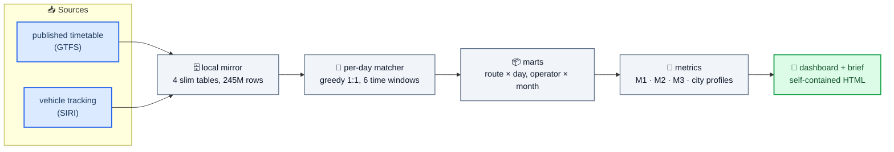

# BusAnalysis — Israel's planned-vs-actual bus record, rebuilt from the open data

**What this is:** an independent reconstruction of whether Israel's scheduled buses actually
ran, departure by departure, for **1,306 service days (January 2023 → July 2026)** and
**117.2 million schedule links** — built entirely from open data on one laptop.

**Why it exists:** the national statistic for "rides that didn't run" has had **no computable
basis since October 2024** (see [F1](handoff/issues/F1-stored-linkage.md)), because the upstream
join it depends on stopped matching. This project rebuilt the comparison for exactly those
months, then measured four service failures that suppress ridership — and, for each one, a fix
that does not require buying a single bus.

> **Start here, no setup needed:** open [`report/dashboard/brief.html`](report/dashboard/brief.html)
> (one screen, four findings) or [`report/dashboard/index.html`](report/dashboard/index.html)
> (the full six-tab dashboard). Both are committed, self-contained, and open by double-click —
> no server, no credentials, no install.

---

## 📊 The findings, in one table

| # | Finding | Figure | Fix direction |
|---|---|---|---|
| 1 | **5.2%** of scheduled departures never appear in the national tracking record (±5 min, 116.4M rides, tracked operators). Widening the window to ±60 min moves it to 4.9% — these are **cancellations, not delays**. | `report/figures/tolerance_curve.png` | Publish the rate per line and per month **with its window stated**. |
| 2 | **~1.7×**: the sparsest lines (under 8 departures/day) lose **7.8%** of departures against **4.6–4.8%** on mid-frequency lines — after the control that kills the naive version of this claim. | `report/figures/density_bands.png` | Protect thin lines first: one missing bus on a two-a-day line is the whole service that day. |
| 3 | **5.0% vs 1.5%**: our reconstructed non-execution rate for 2024-H1 against the figure the ministry's own electronic control published for the same period, both at ±30 min. Unseen failure is unpriced failure. | dashboard → Service metrics → M1 | Compute the violation rate from the open record; the enforcement basis is already electronic. |
| 4 | **4.2 minutes** median *extra* waiting beyond what the published timetable promises, nationally, every month. 11.8% of line-months run 10+ minutes over promise. | dashboard → Service metrics → M2 | Publish a timetable the service can keep — an honest every-20 beats a broken every-10. |

Every number names its time window and its population, and each is reproducible from the
committed aggregates in [`report/metrics/`](report/metrics/). The frozen wording and the
per-claim proof cards live in
[`assistant/verification/headline_stats.md`](assistant/verification/headline_stats.md).

**Also found: five defects in the source data itself.** Those are *not* findings about buses —
they are a maintenance list for whoever runs the database, written up as paste-ready issues in
[`handoff/issues/`](handoff/issues/). Fixing them changes the national number from 7.4% to 5.2%
(and to 42% on the worst days), which is the whole reason they matter.

---

## 🗺️ How it works



The load-bearing design decision: **aggregate locally, never query the billion-row table.**
The pipeline mirrors four slim ride-level tables to disk, then does all matching in-process with
pyarrow. It never touches `siri_vehicle_location` (~6.4 billion rows). That is what makes a
national 3.5-year reconstruction possible on a laptop.

Full detail: [`docs/ARCHITECTURE.md`](docs/ARCHITECTURE.md).

---

## 🚀 Getting started

**Just want to see the results?** Open the two HTML files linked at the top. That is the whole
first step — they carry every figure embedded.

**Want to run the tests and rebuild the figures?** No credentials needed:

```bash
python -m venv .venv && . .venv/bin/activate    # Windows: .venv\Scripts\activate
pip install -r requirements.txt
python -m pytest -q                              # the full suite
```

**Want to rebuild the whole record from source?** That needs read-only `stride` credentials and
about 7 GB of local disk. Copy `.env.example` to `.env`, fill it in, and follow
[`docs/REPRODUCE.md`](docs/REPRODUCE.md) — it documents every stage, which commands were verified
by running them, and which are expensive.

---

## 📁 What is in here

| Path | What it holds |
|---|---|
| `src/busanalysis/` | `pipeline/` (mirror, per-day extract, marts) · `matching/` (the 1:1 matcher) · `quality/` (filters) · `metrics/` (M1–M3, city profiles) · `viz/` (figures, dashboard, brief) |
| `tests/` | the test suite — the pipeline's actual specification |
| `report/dashboard/` | **the deliverables**: `index.html` (6 tabs) and `brief.html` (one screen) |
| `report/metrics/` | committed aggregate outputs (~9 MB) — re-check any number without a rebuild |
| `report/figures/` | every figure, static PNG + interactive HTML |
| `handoff/` | **for the maintainer**: five paste-ready defect issues + open questions |
| `docs/` | architecture, data sources, reproduction |
| `assistant/` | the research record: findings ledger, verification memos, decisions, dead ends |
| `plans/` | the plans each work phase was executed from |
| `data/` | **not committed** — the ~7 GB warehouse is rebuilt locally, see `docs/DATA.md` |

`assistant/` is a research memory, not a runtime dependency: nothing in the pipeline reads it.
It is committed because it is where the *reasoning* lives — including
[`ATTEMPTS_AND_FAILURES.md`](assistant/ATTEMPTS_AND_FAILURES.md), the dead ends, which is usually
the most expensive thing to rediscover.

---

## ⚠️ How to read the numbers honestly

Four rules the analysis holds itself to. They are stated on the dashboard too, but they matter
enough to repeat before anyone quotes a figure:

1. **Every rate names its time window.** There is no tolerance-free answer to "did the bus run?"
   A figure without a window is not reproducible and cannot be compared to one that has it.
2. **These are claims about the tracking record, not about the road.** A ride the tracking feed
   never saw counts as missing here. No independent national bound exists on the feed's own
   completeness, so the phrasing is always "never appears in the record" — never "the bus didn't
   run".
3. **The time differences in this data are scheduled-against-scheduled, not punctuality.** The
   record holds no observed departure time, so nothing here is a lateness measure. Metric M2 is a
   *waiting* measure. Actual lateness needs stop-level data and is on the roadmap, not in scope.
4. **Five operators have no tracking feed at all** (2.3% of the national schedule). They are
   excluded from every performance rate and reported as a finding in their own right — counting
   them as cancellations is most of how 5.2% becomes 7.4%.

Aggregate-only, by policy: no vehicle- or driver-level detail appears in any committed artifact.
The coarsest committed grain is route × month, verified.

---

## 🙏 Credits and provenance

Built on the open data infrastructure of **[Hasadna — The Public Knowledge
Workshop](https://www.hasadna.org.il/)** (`stride`, the Open Bus project) and the Israeli
Ministry of Transport's published GTFS and SIRI feeds. Prior art that this work builds on and
positions against — `open-bus-map-search`, markav.net, Transit Analyst Israel — is catalogued in
[`data/registry/prior_art.md`](data/registry/prior_art.md).

The five data defects are reported upstream in the spirit of the project they came from: the
data is a volunteer-built public good, and these are contributions to it, not complaints about
it.

**Licence:** [MIT](LICENSE).
