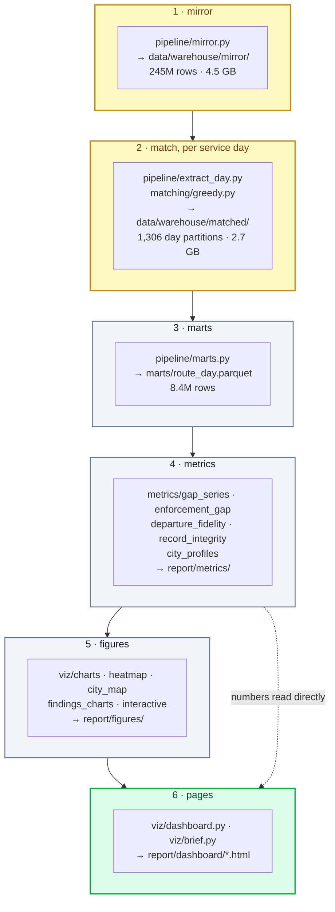

# Architecture

How the pipeline turns two national feeds into the numbers on the dashboard, and why it is built
the way it is.

## The constraint that shaped everything

**Local compute only.** No cloud, no self-hosted replica of the source database.
That single constraint decided the whole design, because the obvious approach — query the
tracking table for what you need, per day — does not survive contact with the data:
`siri_vehicle_location` holds roughly **6.4 billion rows**.
This project never touches it.

What it does instead: mirror four slim ride-level tables to local disk once, then do all matching
in-process with pyarrow.
A national 3.5-year reconstruction then fits on a laptop, and re-running an analysis costs minutes
instead of a day of server queries.

## The stages

Stages 1–2 are the expensive ones and need database credentials.
Stages 3–6 are local and cheap; **stage 6 alone reproduces both published pages** from the
committed `report/metrics/` aggregates, which is why a fresh clone can show a reader something
without any credentials at all.

| Stage | Module | Reads | Writes | Credentials |
|---|---|---|---|---|
| 1 · mirror | `pipeline/mirror.py`, `pipeline/db.py` | stride Postgres (read-only) | `data/warehouse/mirror/` | **yes** |
| 2 · match | `pipeline/extract_day.py`, `pipeline/stage1_days.py`, `pipeline/backfill.py`, `matching/greedy.py`, `matching/validate.py` | the mirror | `data/warehouse/matched/` + `manifest.json` | no |
| 3 · marts | `pipeline/marts.py`, `quality/filters.py` | matched partitions | `data/warehouse/marts/` | no |
| 4 · metrics | `metrics/*.py` | marts | `report/metrics/**` (committed) | no |
| 5 · figures | `viz/charts.py`, `heatmap.py`, `city_map.py`, `findings_charts.py`, `interactive.py` | metrics + marts + geo | `report/figures/**` (committed) | no |
| 6 · pages | `viz/dashboard.py`, `viz/brief.py` | metrics + marts + figures | `report/dashboard/*.html` (committed) | no |

## The matcher, which is where the real work is

For each service day, for each `(operator, line)` partition: take the planned departures from that
day's timetable snapshot and the actual rides from the tracking feed, and assign them **1:1,
greedily, by closest scheduled time** within a tolerance.

Design decisions worth knowing before you trust the output:

- **1:1 assignment, not `EXISTS`.** An `EXISTS` test lets one real bus satisfy several scheduled
  departures, which mechanically under-counts missing service on frequent lines. 1:1 is the
  physically correct constraint. (This is why an earlier sampled estimate of 3.6% was too low.)
- **Six tolerance windows at once** — 0, 180, 300, 600, 1800, 3600 seconds. Every mart column is
  suffixed with its window (`gap_300s`, `matched_600s`). Nothing downstream can accidentally
  compare two different windows, and the "is it a cancellation or a delay?" question becomes a
  column comparison rather than a re-run.
- **Direction-relaxed, `journey_ref` off.** Both were measured to help precision, not hurt it.
- `planned = matched_t + gap_t` is **raise-guarded** at every tolerance — if the identity ever
  breaks, the pipeline stops rather than emitting a plausible-looking rate.

### Four corrections the matcher must apply, or the answer is wrong

Each of these is a defect in the source data, documented as an issue in
[`../handoff/issues/`](../handoff/issues/):

1. **Deduplicate the actual side** on `(operator, line, journey_ref)` per day — [F6](../handoff/issues/F6-duplicate-rides.md), ~3.2M surplus rows.
2. **Deduplicate the planned side** on `(gtfs_route_id, start_time)` — [F8](../handoff/issues/F8-stale-gtfs-release.md), stale releases that double a day's schedule.
3. **Allow ±1 day of snapshot overlap**, then resolve cross-day, home-day-first — a ride near
   midnight must match the timetable it actually belongs to.
4. **Exclude operators with no tracking feed** from performance rates — [F9](../handoff/issues/F9-coverage-holes.md).

Skip them and the national rate reads 7.4% instead of 5.2%; on the worst days, 42%.
That is the whole reason the corrections are load-bearing rather than pedantic.

Validation gate before the matcher was used at scale: **precision 99.88%** on 780k pairs against
stride's own stored matches across 10 stratified days in the era when stride's matching still
worked, recovering 5,472 rides stride had missed, 98.4% forced-unique.
See [`../assistant/verification/matcher_validation.md`](../assistant/verification/matcher_validation.md).

## Conventions that hold across the codebase

- **Raise, never fall back.** No silent recovery, no symptom-masking guards. A missing input is an
  error, with one deliberate exception: `viz/dashboard.py` renders a "processing" card for an
  *absent* file (it was designed to run mid-pipeline), but still raises on a file that exists and
  is malformed. `viz/brief.py` has no such tolerance — it raises.
- **Tolerance-stated columns.** Any rate-bearing column names its window. There are no unqualified
  `gap_rate` columns anywhere.
- **Frozen numbers are transcribed, never recomputed** in the presentation layer. Both pages carry
  a `FROZEN` dict transcribed from
  [`../assistant/verification/headline_stats.md`](../assistant/verification/headline_stats.md),
  and the dashboard **raises a visible reconciliation warning** if the live computation drifts from
  the frozen value beyond a tolerance. That is the project's guard against a number changing
  silently under a claim.
- **Aggregate-only.** No vehicle- or driver-level identifier appears in any committed artifact.
  The coarsest committed grain is route × month. This is a hard rule, not a preference: the
  tracking data can identify individual drivers' shifts, and it will not be used that way.
- **The tests are the specification.** 395 of them. If you want to know what a stage guarantees,
  read its test file before its implementation.

## Where the judgment lives, not just the code

Three directories carry reasoning rather than logic, and they are committed on purpose:

- [`../assistant/verification/`](../assistant/verification/) — the findings ledger, the frozen
  headline statistics with per-claim proof cards, the matcher validation, the validity memo.
- [`../assistant/ATTEMPTS_AND_FAILURES.md`](../assistant/ATTEMPTS_AND_FAILURES.md) — the dead ends.
  Usually the most expensive thing to rediscover.
- [`../assistant/DECISIONS.md`](../assistant/DECISIONS.md) — dated decisions with their reasons, so
  a choice that looks arbitrary can be traced to what forced it.

`CLAUDE.md` at the repo root is the governing document the work was executed under (goal,
constraints, rules of engagement). It is addressed to an AI assistant, but it reads as a project
charter and is the fastest way to understand what this project was and was not trying to do.
